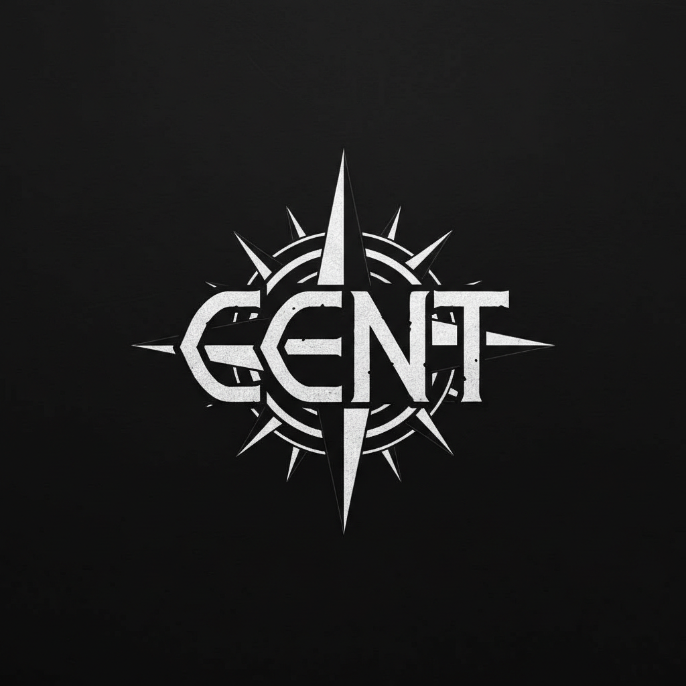

# 🏠 CENT Family Bot

<p align="center">
  
</p>

**Многофункциональный Discord-бот для управления семьёй CENT**

[](https://python.org)
[](https://discordpy.readthedocs.io)
[](LICENSE)
[](https://github.com/Neo-Gh0st/Fam_bot)

---

## 📋 Описание

Бот автоматизирует управление Discord-семьёй: отображает состав, обрабатывает заявки, ведёт статистику и логирует активность.

## ✨ Возможности

| Функция | Описание |
|---------|----------|
| 👥 **Состав семьи** | Автоматическое отображение участников по ролям (Owner → Deputy Owner → High Rank → Medium Rank → CENT) |
| 🪖 **Рекруты** | Персональные инвайт-ссылки со счётчиком приглашённых |
| 📝 **Заявки в семью** | Многоступенчатая форма с анкетой и скриншотами |
| 🎂 **Дни рождения** | Плашка с напоминаниями и поздравлениями |
| ⚙️ **Панель управления** | Кнопки для собраний и объявления |
| 🛡️ **Верификация** | Автоматическая выдача ролей через реакции |
| 🚫 **Чёрный список** | Модерация через dedicated канал |
| 🤖 **AI-помощник** | Генерация текстов через NVIDIA API |
| 📢 **Уведомления** | Автоматические приветствия и логирование |

## 🚀 Быстрый старт

### 1. Клонируйте репозиторий

```bash
git clone https://github.com/Neo-Gh0st/Fam_bot.git
cd Fam_bot
```

### 2. Установите зависимости

```bash
pip install -r requirements.txt
```

### 3. Настройте переменные окружения

Скопируйте `.env.example` в `.env` и заполните значениями:

```bash
cp .env.example .env
```

### 4. Запустите бота

```bash
python bot.py
```

## ⚙️ Переменные окружения

| Переменная | Описание | Обязательна |
|------------|----------|-------------|
| `BOT_TOKEN` | Токен бота из Developer Portal | ✅ |
| `CLIENT_ID` | ID приложения Discord | ✅ |
| `GUILD_ID` | ID сервера | ✅ |
| `TARGET_CHANNEL_ID` | Канал состава семьи | ✅ |
| `RECRUIT_BOARD_CHANNEL_ID` | Канал плашки рекрутов | ❌ |
| `INVITE_CHANNEL_ID` | Канал для инвайт-ссылок | ❌ |
| `RECRUIT_REPORT_CHANNEL_ID` | Канал отчётов рекрутов | ❌ |
| `BIRTHDAY_BOARD_CHANNEL_ID` | Канал дней рождения | ❌ |
| `BIRTHDAY_GREETING_CHANNEL_ID` | Канал поздравлений | ❌ |
| `LOG_CHANNEL_ID` | Канал логов | ❌ |
| `WELCOME_CHANNEL_ID` | Канал приветствий | ❌ |
| `AUTOMOD_CHANNEL_ID` | Канал автоматизации | ❌ |
| `APP_CREATE_CHANNEL_ID` | Канал создания заявок | ❌ |
| `APP_LOG_CHANNEL_ID` | Канал логов заявок | ❌ |
| `APP_CATEGORY_ID` | Категория для тикетов заявок | ❌ |
| `RECRUIT_APP_BANNER_CHANNEL_ID` | Канал баннера рекрутов | ❌ |
| `RECRUIT_APP_LIST_CHANNEL_ID` | Канал списка рекрутов | ❌ |
| `ADMIN_PANEL_CHANNEL_ID` | Канал панели управления | ❌ |
| `MEETING_ROLE_ID` | Роль для уведомлений о собраниях | ❌ |
| `MEETING_VOICE_CHANNEL_ID` | Голосовой канал собрания | ❌ |
| `NVIDIA_API_KEY` | API-ключ NVIDIA для AI | ❌ |
| `BLACKLIST_CHANNEL_ID` | Канал чёрного списка | ❌ |
| `VERIFICATION_ROLE_ID` | Роль для верификации | ❌ |
| `VERIFICATION_EMOJI` | Эмоди для верификации | ❌ |

## 🎮 Команды

| Команда | Описание | Права |
|---------|----------|-------|
| `/family` | Обновить таблицу состава семьи | — |
| `/recruit` | Показать инвайт-ссылку рекрута | Рекрут |
| `/report_invite` | Отчёт по приглашённому | Рекрут |
| `/recruits` | Обновить плашку рекрутов | Manage Server |
| `/birthday` | Добавить день рождения | — |
| `/admin_panel` | Обновить панель управления | Manage Server |
| `/clear N` | Удалить N сообщений | Manage Messages |
| `/nuke` | Полная очистка канала | Manage Server |
| `/ai "вопрос"` | Задать вопрос AI | — |
| `/set_bot_image` | Обновить изображения бота | Manage Server |
| `/verification_message` | Отправить сообщение для верификации | Manage Server |
| `/test` | Проверка бота | — |

## 🏗 Роли семьи

| Роль | Описание |
|------|----------|
| Owner | Руководитель семьи |
| Deputy Owner | Заместитель руководителя |
| High Rank | Высокий ранг |
| Medium Rank | Средний ранг |
| CENT | Базовая роль семьи |
| Recruit | Рекрут (ожидает верификации) |

## 📦 Деплой

### Railway (рекомендуется)

1. Зайдите на [railway.app](https://railway.app)
2. Подключите GitHub-репозиторий
3. Добавьте переменные окружения
4. Нажмите **Deploy**

## 📁 Структура проекта

```
Fam_bot/
├── bot.py              # Основной файл бота (вся логика)
├── requirements.txt    # Зависимости
├── .env.example        # Пример переменных окружения
├── .gitignore          # Игнорируемые файлы
├── assets/
│   └── cent.png        # Логотип семьи
└── README.md           # Этот файл
```

## 🤝 Участие

1. Fork проект
2. Создайте ветку (`git checkout -b feature/amazing-feature`)
3. Коммитьте изменения (`git commit -m 'Add amazing feature'`)
4. Push в ветку (`git push origin feature/amazing-feature`)
5. Откройте Pull Request

## 📄 Лицензия

Проект лицензирован по MIT — смотрите файл [LICENSE](LICENSE) для подробностей.

## 📞 Контакты

- **Discord**: zaca14325
- **GitHub**: [@Neo-Gh0st](https://github.com/Neo-Gh0st)

---

<div align="center">

**Сделано с ❤️ для семьи CENT**

</div>
